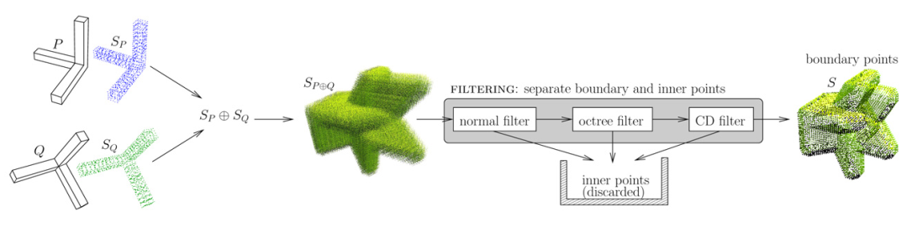

# A Survey on Work Related to Offset Mesh Generation

Here is a list of related work on offset mesh generation that I have collected and complied.
I will update this list on a regular basis.

The emoji :white_check_mark: after the `[code]` indicates that this code has been verified by me to be valid.

:clap: If you have any suggestions for improvements, please raise an issue or contact me.

# :page_with_curl: Papers

<table> 
<!-- ---------------------------------------------------------------------- -->
<tr>
<td>

<td>

**OffsetCrust: Variable-Radius Offset Approximation with Power Diagrams**

Zihan Zhao, [Pengfei Wang](https://pengfei.me/), [Shuangmin Chen](https://xk.qust.edu.cn/info/1041/4695.htm), Minfeng Xu, [Shuangmin Chen](https://xk.qust.edu.cn/info/1041/4695.htm), [Shiqing Xin](https://irc.cs.sdu.edu.cn/~shiqing/index.html), [Changhe Tu](https://irc.cs.sdu.edu.cn/~chtu/index.html), [Wenping Wang](https://engineering.tamu.edu/cse/profiles/Wang-Wenping.html)

15 July 2025, arXiv
<td>

- [[Paper]](https://arxiv.org/abs/2507.10924)
</tr>
<!-- ---------------------------------------------------------------------- -->
<tr>
<td>

<td>

**Towards Voronoi Diagrams of Surface Patches**

[Pengfei Wang](https://pengfei.me/), Jiantao Song, [Lei Wang](https://alan-leo-wong.github.io/), [Shiqing Xin](https://irc.cs.sdu.edu.cn/~shiqing/index.html), [Dongming Yan](https://people.ucas.ac.cn/~dmyan), [Shuangmin Chen](https://xk.qust.edu.cn/info/1041/4695.htm), [Changhe Tu](https://irc.cs.sdu.edu.cn/~chtu/index.html), [Wenping Wang](https://engineering.tamu.edu/cse/profiles/Wang-Wenping.html)

17 Jan 2025, TVCG
<td>

- [[Paper]](https://ieeexplore.ieee.org/document/10845125)
- [[PDF]](https://pengfei.me/assets/papers/spaceVoronoi.pdf)
</tr>
<!-- ---------------------------------------------------------------------- -->
<tr>
<td>

<td>

**Robust and Feature-Preserving Offset Meshing**

Hongyi Cao, Gang Xu, Renshu Gu, Jinlan Xu, Xiaoyu Zhang, Timon Rabczuk, Yuzhe Luo, [Xifeng Gao](https://gaoxifeng.github.io/)

20 Dec 2024, arXiv
<td>

- [[Paper]](https://arxiv.org/abs/2412.15564)
</tr>
<!-- ---------------------------------------------------------------------- -->
<tr>
<td>

<td>

**PCO: Precision-Controllable Offset Surfaces with Sharp Features**

[Lei Wang](https://alan-leo-wong.github.io/), Xudong Wang, [Pengfei Wang](https://pengfei.me/), [Shuangmin Chen](https://xk.qust.edu.cn/info/1041/4695.htm), [Shiqing Xin](https://irc.cs.sdu.edu.cn/~shiqing/index.html), Jiong Guo, [Wenping Wang](https://engineering.tamu.edu/cse/profiles/Wang-Wenping.html), [Changhe Tu](https://irc.cs.sdu.edu.cn/~chtu/index.html)

19 Nov 2024, TOG (SIGGRAPH Asia 2024)
<td>

- [[Paper]](https://dl.acm.org/doi/10.1145/3687920)
- [[Project Page]](https://alan-leo-wong.github.io/SIGASIA24-PCO-ProjectPage/) 
- [[Code (coming soon...)]](https://alan-leo-wong.github.io/SIGASIA24-PCO-ProjectPage/)
</tr>
<!-- ---------------------------------------------------------------------- -->
<tr>
<td>

<td>

**Topological Offsets**

[Daniel Zint](https://daniel-zint.github.io/), Zhouyuan Chen, Yifei Zhu, [Denis Zorin](https://cims.nyu.edu/gcl/denis.html), Teseo Schneider, [Daniele Panozzo](https://cims.nyu.edu/gcl/daniele.html)

10 Jul 2024, arXiv
<td>

- [[Paper]](https://arxiv.org/abs/2407.07725) 
- [[Test Data]](https://github.com/daniel-zint/topological-offsets-data) 
</tr>
<!-- ---------------------------------------------------------------------- -->
<tr>
<td>

<td>

**Feature-preserving shrink wrapping with adaptive alpha**

Jiayi Dai, Yiqun Wang, [Dongming Yan](https://people.ucas.ac.cn/~dmyan)

Jun 2024, CAGD (GMP 2024)
<td>

- [[Paper]](https://www.sciencedirect.com/science/article/pii/S0167839624000554)
</tr>
<!-- ---------------------------------------------------------------------- -->
<tr>
<td>

<td>

**Feature-Preserving Offset Mesh Generation from Topology-Adapted Octrees**

[Daniel Zint](https://daniel-zint.github.io/), Nissim Maruani, M Rouxel-Labb, [Pierre Alliez](https://team.inria.fr/titane/pierre-alliez/)

10 Aug 2023, CGF (Eurographics Symposium on Geometry Processing 2023)
<td>

 - [[Paper]](https://onlinelibrary.wiley.com/doi/abs/10.1111/cgf.14906)
 - [[Code]](https://github.com/daniel-zint/offsets-and-remeshing):white_check_mark:
</tr>
<!-- ---------------------------------------------------------------------- -->
<tr>
<td>

<td>

**A Parallel Feature-preserving Mesh Variable Offsetting Method with Dynamic Programming**

Hongyi Cao, Gang Xu, Renshu Gu, Jinlan Xu, Xiaoyu Zhang, Timon Rabczuk

13 Oct 2023, arXiv
<td>

- [[Paper]](https://arxiv.org/abs/2310.08997)
- [[Code]](https://github.com/iGame-Lab/PFPOffset?tab=readme-ov-file)

</tr>
<!-- ---------------------------------------------------------------------- -->
<tr>
<td>

<td>

**Alpha wrapping with an offset**

Cédric Portaneri, Mael Rouxel-Labbé, Michael Hemmer, [David Cohen-Steiner](https://www-sop.inria.fr/members/David.Cohen-Steiner/), [Pierre Alliez](https://team.inria.fr/titane/pierre-alliez/)

22 Jul 2022, TOG
<td>

- [[Paper]](https://dl.acm.org/doi/abs/10.1145/3528223.3530152) 
- [[Code (available in CGAL)]](https://github.com/CGAL/cgal/):white_check_mark:
- [[Documentation]](https://doc.cgal.org/latest/Alpha_wrap_3/index.html#Chapter_3D_Alpha_wrapping)
</tr>
<!-- ---------------------------------------------------------------------- -->
<tr>
<td>

<td>

**Half-Space Power Diagrams and Discrete Surface Offsets**

Zhen Chen, [Daniele Panozzo](https://cims.nyu.edu/gcl/daniele.html), Jérémie Dumas

14 Oct 2019, TVCG
<td>

- [[Paper]](https://ieeexplore.ieee.org/abstract/document/8865648) 
- [[Project Page]](https://www.jdumas.org/publication/2019/voroffset/) 
- [[Code]](https://github.com/geometryprocessing/voroffset):white_check_mark: 
- [[Video]](https://www.youtube.com/watch?v=u8qtOkJqEO0)
</tr>
<!-- ---------------------------------------------------------------------- -->
<tr>
<td>

<td>

**Efficiently computing feature-aligned and high-quality polygonal offset surfaces**

Wenlong Meng, [Shuangmin Chen](https://xk.qust.edu.cn/info/1041/4695.htm), Zhenyu Shu, [Shiqing Xin](https://irc.cs.sdu.edu.cn/~shiqing/index.html), [Hongbo Fu](https://facultyprofiles.hkust.edu.hk/profiles.php?profile=hongbo-fu-hongbofu), [Changhe Tu](https://irc.cs.sdu.edu.cn/~chtu/index.html)

Feb 2018, Computers & Graphics (CAD/Graphics 2017)
<td>

- [[Paper]](https://www.sciencedirect.com/science/article/pii/S0097849317300961)
</tr>
<!-- ---------------------------------------------------------------------- -->
<tr>
<td>

<td>

**Point morphology**

Stéphane Calderon, Tamy Boubekeur

27 Jul 2014, TOG
<td>

-[[Paper]](https://dl.acm.org/doi/10.1145/2601097.2601130)
</tr>
<!-- ---------------------------------------------------------------------- -->
<tr>
<td>

<td>

**Thickening freeform surfaces for solid fabrication**

[Charlie C.L. Wang](https://mewangcl.github.io/), Yong Chen

30 Sep 2013, Rapid Prototyping Journal
<td>

- [[Paper]](https://www.emerald.com/insight/content/doi/10.1108/rpj-02-2012-0013/full/html)
- [[Project Page]](https://mewangcl.github.io/Projects/MeshThickeningProj.htm)
- [[Code]](https://mewangcl.github.io/Projects/MeshThickeningProj.htm):white_check_mark:
</tr>
<!-- ---------------------------------------------------------------------- -->
<tr>
<td>

<td>

**GPU-based offset surface computation using point samples**

[Charlie C.L. Wang](https://mewangcl.github.io/), Dinesh Manocha

Feb 2013, CAD (Solid and Physical Modeling 2012)
<td>

- [[Paper]](https://www.sciencedirect.com/science/article/pii/S0010448512002205)
- [[Project Page]](https://mewangcl.github.io/Projects/GPUBasedLDNI_DLLProj.htm)
- [[Code]](https://mewangcl.github.io/Projects/GPUBasedLDNI_DLLProj.htm):white_check_mark:
</tr>
<!-- ---------------------------------------------------------------------- -->
<tr>
<td>

<td>

**Uniform offsetting of polygonal model based on Layered Depth-Normal Images**

Yong Chen, [Charlie C.L. Wang](https://mewangcl.github.io/)

Jan 2011, CAD
<td>

- [[Paper]](https://www.sciencedirect.com/science/article/pii/S0010448510001697)
</tr>
<!-- ---------------------------------------------------------------------- -->
<tr>
<td>

<td>

**Polygonal Boundary Evaluation of Minkowski Sums and Swept Volumes**

Marcel Campen, Leif Kobbelt

21 Sep 2010, CGF
<td>

- [[Paper]](https://onlinelibrary.wiley.com/doi/abs/10.1111/j.1467-8659.2010.01770.x)
</tr>
<!-- ---------------------------------------------------------------------- -->
<tr>
<td>

<td>

**Fast Intersection-Free Offset Surface Generation From Freeform Models With Triangular Meshes**

[Shengjun Liu](https://faculty.csu.edu.cn/liushengjun/en/lwcg/2772/list/index.htm), [Charlie C.L. Wang](https://mewangcl.github.io/)

13 Sep 2010, IEEE Transactions on Automation Science and Engineering
<td>

- [[Paper]](https://ieeexplore.ieee.org/document/5570949)
</tr>
<!-- ---------------------------------------------------------------------- -->
<tr>
<td>

<td>

**Topology-Adaptive Mesh Deformation for Surface Evolution, Morphing, and Multiview Reconstruction**

Andrei Zaharescu, Edmond Boyer, Radu Horaud

07 Jun 2010, Transactions on Pattern Analysis and Machine Intelligence
<td>

- [[Paper]](https://ieeexplore.ieee.org/abstract/document/5482586)
</tr>
<!-- ---------------------------------------------------------------------- -->
<tr>
<td>

<td>

**Offsetting operations on non-manifold topological models**

Sang Hun Lee

Nov 2009, CAD
<td>

- [[Paper]](https://www.sciencedirect.com/science/article/pii/S0010448509001523)
</tr>
<!-- ---------------------------------------------------------------------- -->
<tr>
<td>

<td>

**A Simple Method for Computing Minkowski Sum Boundary in 3D Using Collision Detection**

[Jyh-Ming Lien](https://cs.gmu.edu/~jmlien/doku.php)

2009, Algorithmic Foundation of Robotics VIII
<td>

- [[Paper]](https://cs.gmu.edu/~jmlien/lib/exe/fetch.php?media=lien_wafr08.pdf)
- [[Project Page (may not available now)]](http://masc.cs.gmu.edu/wiki/SimpleMsum)
- [[Code (may not available now)]](http://masc.cs.gmu.edu/wiki/Software#m+3dmesh)
</tr>
<!-- ---------------------------------------------------------------------- -->
<tr>
<td>

<td>

**Covering Minkowski Sum Boundary Using Points with Applications**

[Jyh-Ming Lien](https://cs.gmu.edu/~jmlien/doku.php)

Nov 2008, CAGD (Pacific Graphics 2007)
<td>

- [[Paper]](https://cs.gmu.edu/~jmlien/lib/exe/fetch.php?media=lien-pointbasedminkowskisum.pdf)
- [[Project Page (may not available now)]](http://masc.cs.gmu.edu/wiki/PointMsum)
- [[Code (may not available now)]](http://masc.cs.gmu.edu/wiki/Software#m+3dpt):white_check_mark:
(If you require this code, you can contact me.)
</tr>
<!-- ---------------------------------------------------------------------- -->
<tr>
<td>

<td>

**Exact Minkowski sums of polyhedra and exact and efficient decomposition of polyhedra in convex pieces**

Peter Hachenberger

15 Aug 2008, European Symposium on Algorithms, 2007
<td>

- [[Paper]](https://link.springer.com/chapter/10.1007/978-3-540-75520-3_59)
</tr>
<!-- ---------------------------------------------------------------------- -->
<tr>
<td>

<td>

**Filleting and rounding using a point-based method**

Yong Chen, Hongqing Wang, David W. Rosen, Jarek Rossignac

11 Jun 2008, Design Automation Conference
<td>

- [[Paper]](https://asmedigitalcollection.asme.org/IDETC-CIE/proceedings-abstract/IDETC-CIE2005/533/313972)
</tr>
<!-- ---------------------------------------------------------------------- -->
<tr>
<td>

<td>

**High-Resolution Volumetric Computation of Offset Surfaces with Feature Preservation**

Darko Pavić, Leif Kobbelt

24 Apr 2008, CGF
<td>

- [[Paper]](https://onlinelibrary.wiley.com/doi/abs/10.1111/j.1467-8659.2008.01113.x)
</tr>
<!-- ---------------------------------------------------------------------- -->
<tr>
<td>

<td>

**Point-Based Minkowski Sum Boundary**

[Jyh-Ming Lien](https://cs.gmu.edu/~jmlien/doku.php)

04 Dec 2007, (PG 2007)
<td>

- [[Paper]](https://ieeexplore.ieee.org/abstract/document/4392736)
</tr>
<!-- ---------------------------------------------------------------------- -->
<tr>
<td>

<td>

**Trimming local and global self-intersections in offset curves/surfaces using distance maps**

Joon-Kyung Seong, Gershon Elber, Myung-Soo Kim

Mar 2006, CAD
<td>

- [[Paper]](https://www.sciencedirect.com/science/article/pii/S0010448505001491)
</tr>
<!-- ---------------------------------------------------------------------- -->
<tr>
<td>

<td>

**Triangular mesh offset for generalized cutter**

Su-Jin Kim, Min-Yang Yang

1 Sep 2005
<td>

- [[Paper]](https://www.sciencedirect.com/science/article/pii/S0010448504002027)
</tr>
<!-- ---------------------------------------------------------------------- -->
<tr>
<td>

<td>

**A point-based offsetting method of polygonal meshes**

Yong Chen, Hongqing Wang, David W. Rosen, Jarek Rossignac

2005, ASME Journal of Computing and Information Science in Engineering
<td>

- [[PDF]](https://d1wqtxts1xzle7.cloudfront.net/30743529/OffsetYong-libre.pdf?1392056140=&response-content-disposition=inline%3B+filename%3DA_point_based_offsetting_method_of_polyg.pdf&Expires=1740158862&Signature=YFe6MBnPfTKD9S1RKvAZ0xluWEqlvPeDnujJ-09Fkj0OnEZwnkU~5arEKrZMOukYdvZVnZs2fQ5N3A58MLSOfthSGYWMj0cckyPtSmTyZvLuDd7kKUymoa4B1g8wFRtDj48yauFvARnsH4V4-Kpu225yrUQO~rVcPsLcBRklLe7ODllcc9zICCqmdxa5fezJ27wDKd3nF1UAEm3OmACIHngm3842PmZWBd-Pal5Qj7zXXiXZMZuLMu5xypaFzSegsSfmVKKUxV-tcilELbV3u15XHHNcK0Z3s-BNOPVBzT-R14tEvsmsZnpHyF-3dK13extqNW5LXJNABoiQcudpiw__&Key-Pair-Id=APKAJLOHF5GGSLRBV4ZA)
</tr>
<!-- ---------------------------------------------------------------------- -->
<tr>
<td>

<td>

**Accurate Minkowski sum approximation of polyhedral models**

Varadhan, Gokul, Dinesh Manocha

01 Nov 2004, PG 2004
<td>

- [[Paper]](https://ieeexplore.ieee.org/abstract/document/1348370)
</tr>
<!-- ---------------------------------------------------------------------- -->
<tr>
<td>

<td>

**Offset Triangular Mesh Using the Multiple Normal Vectors of a Vertex**

Su-Jin Kim, Dong-Yoon Lee, Min-Yang Yang

2004, CADA
<td>

- [[Paper]](https://www.tandfonline.com/doi/abs/10.1080/16864360.2004.10738269)
</tr>
<!-- ---------------------------------------------------------------------- -->
<tr>
<td>

<td>

**Self-intersection Removal in Triangular Mesh Offsetting**

Wonhyung Jung, Hayong Shin, Byoung K. Choi

2004, CADA
<td>

- [[Paper]](https://www.tandfonline.com/doi/abs/10.1080/16864360.2004.10738290)
</tr>
<!-- ---------------------------------------------------------------------- -->
<tr>
<td>

<td>

**A new curve-based approach to polyhedral machining**
Cha-Soo Jun, Dong-Soo Kim, Sehyung Park

15 Apr 2002, CAD
<td>

- [[Paper]](https://www.sciencedirect.com/science/article/pii/S0010448501001105)
</tr>
<!-- ---------------------------------------------------------------------- -->
<tr>
<td>

<td>

**A computing strategy for applications involving offsets, sweeps, and Minkowski operations**

E.E. Hartquist, J.P. Menon, K. Suresh, H.B. Voelcker, J. Zagajac

Mar 1999, CAD
<td>

- [[Paper]](https://www.sciencedirect.com/science/article/pii/S0010448599000147)
</tr>
<!-- ---------------------------------------------------------------------- -->
<tr>
<td>

<td>

**Generating Shaded Offset Surfaces with Distance, Closest-Point and Color Volumes**

Breen, David E., Sean Mauch

1999, Proceedings of the international workshop on volume graphics
<td>

- [[Paper]](https://citeseerx.ist.psu.edu/document?repid=rep1&type=pdf&doi=0bf85b578dffca47888bfc1d0be03a48e6d9ce92)
</tr>
<!-- ---------------------------------------------------------------------- -->
<tr>
<td>

<td>

**Offsetting operations on non-manifold boundary representation models with simple geometry**

Sang Hun Lee

1999, Solid Modeling and Applications
<td>

- [[Paper]](https://dl.acm.org/doi/10.1145/304012.304017)
</tr>
<!-- ---------------------------------------------------------------------- -->
<tr>
<td>

<td>

**Intersection of offsets of parametric surfaces**

Yu Wang

Jul 1996, CAGD
<td>

- [[Paper]](https://www.sciencedirect.com/science/article/pii/0167839695000399)
</tr>
<!-- ---------------------------------------------------------------------- -->
</table> 

# :hammer: Projects
- **LDNI-based-Solid-Modeling**: [[Project Page]](https://ldnibasedsolidmodeling.sourceforge.net/) [[Code]](https://github.com/DebbieLeung/LDNI-based-Solid-Modeling):white_check_mark: [[Video]](https://www.youtube.com/watch?v=G75mS1VGqx0&t=2s)

# :floppy_disk: Softwares
- [Rhino 8](https://www.rhino3d.com/cn/) [[Offset Operation Doc]](https://docs.mcneel.com/rhino/8/help/en-us/commands/offsetmesh.htm)
  - The `OffsetMesh` operation in Rhino 8 is accomplished by directly moving the vertices, while the `OffsetSrf` operation on a B-rep input produces results that are more akin to the widely recognized offset results.
- [CATIA](https://www.3ds.com/zh-hans/products/catia)
- [NX](https://plm.sw.siemens.com/zh-CN/nx/?srsltid=AfmBOoqVvD7xm--0SrXLfoSCzDYG5D8kePOvU2nJxRQD64bCXcqZ5d3e)
  - It may be one of the better industrial software for performing offset mesh operations, but in many cases it is unable to complete the operation, possibly due to the generation of self-intersections.
- [Solidworks](https://www.solidworks.com/)
- [ZW3D](https://www.zwsoft.com/product/zw3d)
  - It seems to utilize a method involving the use of voxels for isosurface extraction.
- [CAXA](https://www.caxa.com/)